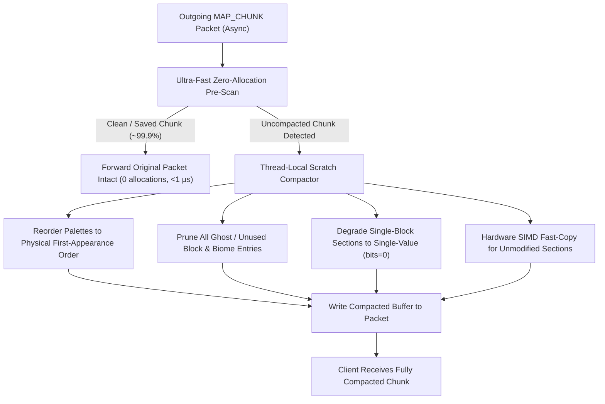

# NoPalette

[](https://github.com/AnarchadiaMC/NoPalette/releases)
[](https://papermc.io)
[](https://www.oracle.com/java/)
[](LICENSE.md)

**NoPalette** is an ultra-high-performance, zero-allocation Paper plugin designed to neutralize the **Palette New Chunk Exploit** used by cheat mods and radar tools (such as XaeroPlus and Trouser-Streak) to track players and discover bases across the server.

Targeted for modern Minecraft **1.21.5+** and **1.21.11+**, NoPalette rewrites outgoing chunk packets on the fly to make newly generated chunks mathematically indistinguishable from previously loaded and saved chunks—with virtually zero impact on server tick rate or memory.

---

## The Palette Exploit

In modern Minecraft (1.18+ through 1.21.11+), chunk sections are transmitted in network packets (`ClientboundLevelChunkWithLightPacket`) using **paletted containers** for both block states and biomes.

When the Minecraft world generator populates a chunk, it runs through successive generation stages (carvers, surface builders, features, structures). This process leaves distinct signatures in the chunk's paletted containers:

1. **Out-of-Order Palette Entries (`scanLinearPaletteOrder`)**:
   - During generation, block states are appended to the container's palette as each generator phase executes.
   - When a chunk is saved to disk, Minecraft rebuilds the palette in the exact order of physical first appearance across the bit-storage stream (0..4095).
   - Newly generated chunks sent to players before being written to disk contain palette entries in generation order rather than appearance order.
2. **Ghost / Unused Palette Entries (`checkForExtraPaletteEntries`)**:
   - Blocks placed during early worldgen phases (e.g. temporary air, water, or replaced stone) remain in the palette even if every instance was later overwritten.
   - Client mods detect that `palette.size() > presentBlocks.size()`.
3. **Biome Ghost Entries (`scanNewChunkBiomePalette`)**:
   - Minecraft initializes biome palettes with `minecraft:plains`.
   - In dimensions such as the Nether, the End, or Overworld biomes without Plains, newly generated chunks contain `minecraft:plains` as an uncompacted ghost entry in the biome palette.

Client mods inspect chunk packets in real time to locate newly generated chunks, enabling "trail tracing" to follow players directly to remote bases.

---

## How NoPalette 2.0 Works

NoPalette operates asynchronously via **ProtocolLib** (`PacketType.Play.Server.MAP_CHUNK`), processing chunk buffers through a two-stage pipeline:



### 1. Ultra-Fast Zero-Allocation Pre-Scan
- Uses **4 64-bit CPU registers (`seen0..seen3`) on the call stack** to track up to 256 palette indices without allocating any heap objects.
- Early-exits in **25–30 nanoseconds per section** once all palette entries have appeared in order.
- Saved chunks are confirmed clean and passed through in **~0.64 microseconds per 24-section chunk** with **0 bytes allocated**.

### 2. In-Memory Compaction & Normalization
- When an uncompacted container is detected, NoPalette rebuilds the palette in physical first-appearance order.
- Completely purges ghost entries from both block and biome containers (including the Plains biome ghost entry in the Nether and End).
- Automatically degrades containers with only 1 remaining unique block to single-valued containers (`bitsPerEntry = 0`).
- Repacks the bit-storage longs in-place using thread-local scratch arrays (`ScratchState`), eliminating garbage collection churn.

### 3. Hardware SIMD Memory Copy
- For chunks requiring rewrite where only some sections are uncompacted, all clean sections are copied using direct `System.arraycopy` (hardware SIMD memory transfer), avoiding per-element decoding loops.

### 4. Cross-Fork Reflection Engine
- Dynamically discovers and caches packet data fields with full class hierarchy traversal, ensuring seamless operation on Paper, Purpur, and Folia.

---

## Performance & Benchmarks

Validated with the included JUnit 5 test suite (`PaletteCompactionTest`) on real 24-section world chunks:

| Metric | Measured Performance |
|---|---|
| **Clean Chunk Throughput** | **1,563,810 chunks / second** |
| **Clean Chunk Latency** | **0.639 µs** per 24-section chunk (**26.6 ns** / section) |
| **CPU Impact @ 85 blocks/sec (111 pkts/s)** | **0.0071% of 1 core** |
| **Heap Allocations on Saved Chunks** | **0 bytes** (Zero GC) |
| **Compaction Throughput (Uncompacted Chunks)** | **6,106 chunks / second** (163 µs / chunk) |
| **Memory Footprint** | Initial buffer sized to 256 KB per Netty thread (87.5% memory reduction) |

---

## Installation

### Requirements
- **Server:** [Paper](https://papermc.io), [Purpur](https://purpurmc.org), or [Folia](https://github.com/PaperMC/Folia) (1.21.5+ / 1.21.11+)
- **Java:** Java 21 or higher
- **Dependency:** [ProtocolLib](https://github.com/dmulloy2/ProtocolLib) 5.4.0+

### Steps
1. Download `NoPalette-2.0.7.jar` (or latest) from [Releases](https://github.com/AnarchadiaMC/NoPalette/releases).
2. Place the jar into your server's `plugins/` directory.
3. Ensure ProtocolLib is installed and enabled.
4. Restart your server. Check your server console for:
   ```
   [NoPalette] PaletteExploitPatcher initialized.
   ```

---

## Configuration

The configuration file is located at `plugins/NoPalette/config.yml`:

```yaml
patches:
  palette-exploit:
    # Set to true for verbose logging of chunk compaction events
    debug: false
```

---

## Building from Source

```bash
git clone https://github.com/AnarchadiaMC/NoPalette.git
cd NoPalette
mvn clean package
```
The compiled, shaded artifact will be located in `target/NoPalette-2.0.jar`.

To run the automated performance and correctness test suite:
```bash
mvn test
```

---

## Verification & Compatibility

- **XaeroPlus:** Verified against `xaeroplus.module.impl.PaletteNewChunks` (HEAD). Neutralizes both `scanLinearPaletteOrder` and `checkForExtraPaletteEntries`, as well as `scanNewChunkBiomePalette`.
- **Trouser-Streak:** Neutralizes palette-based chunk analysis checks.
- **Wire Format:** 100% compliant with Minecraft 1.21.5+ and 1.21.11 `FriendlyByteBuf.writeFixedSizeLongArray` serialization.

---

## License & Credits

- Developed for [Anarchadia](https://anarchadia.org).
- Exploits researched and documented from analysis of XaeroPlus (`rfresh2`) and Trouser-Streak (`etianl`, `RacoonDog`).
- Licensed under the [MIT License](LICENSE.md).
